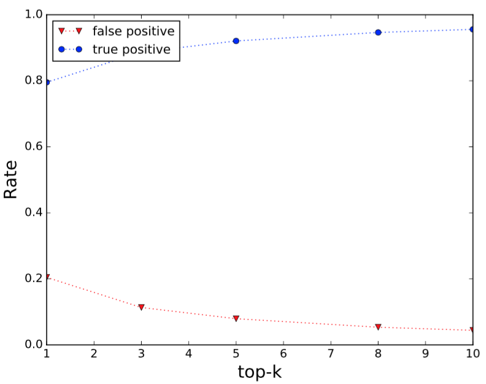
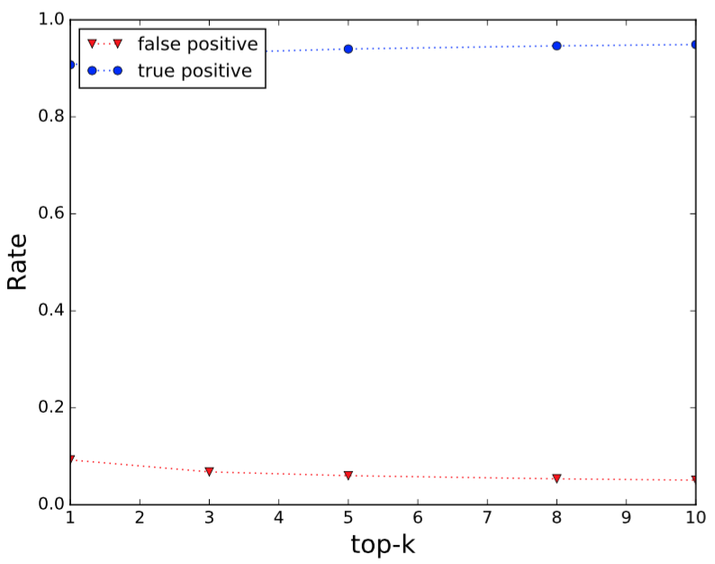
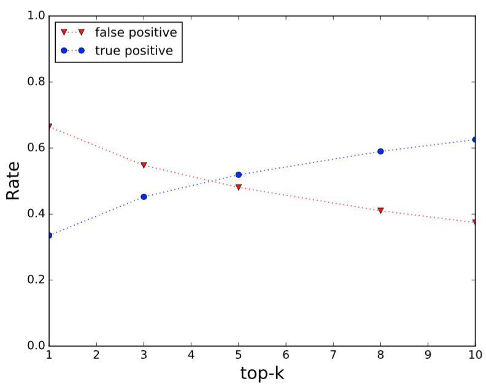
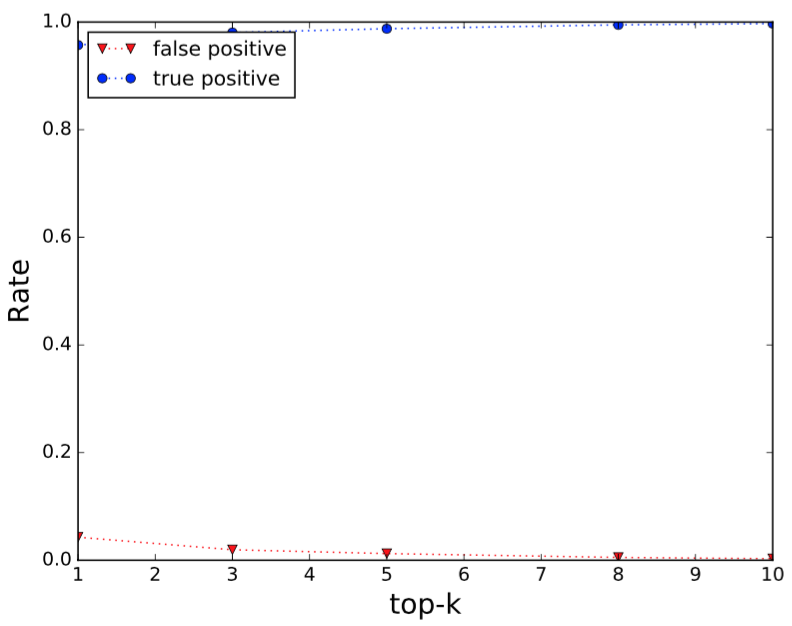

# Learning to Correlate Accounts across Online Social Networks: An Embedding-based Approach

Overview of the proposed approach. For simplicity, we use two networks G and G’ to explain the flow of cross-site account correlating. Network can directed or undirected (each link can be viewed as two directed links). First, two corpuses are generated using the tradtional random walk method. Second, each account (node) representation is learned via hs-ACCM or ns-ACCM. Then we align two embedding spaces into a common space. Finally, accounts close to each are likely to be linked to the same identity between G and G’.


..* ## Implementation details:
### "Corpus" Generation
```
ACCM uses a function RandomWalk(·) to generate account sequences, which works as follows: it starts at a vertex 
(account) and proceeds along an uniformly randomly selected edge to visit its neighboring account 
at each step, until the maximum length (e.g., L) is reached. 
```
### Representation Learning
```
We apply SG model to the network to learn node representations while capturing latent structural relationships 
among nodes. 
```
### Transformation Matrix (W) Learning
```
After learning social representations of accounts into a low-dimensional space for each network, we need to 
transform these learned embeddings across two (or more) networks to a common space for comparison. In this 
work, we train a linear regression model to learn the transformation matrix towards this goal.
```
### Alignment and Correlation
```
Finally, the account correlation can be performed through the k-nearest neighbor searching. More formally, 
for any account in a network G (∀a ∈ V ), we project its learned representation vector v to the embedding 
space of the network G′ using the optimal W*. A. a new vector is obtained v′a = W* · va. In the representation 
space of network G′, we then calculate the cosine similarity between vector v′(a) and each embedding vector 
v in V′, and return the top-k similar results as the predicted correlated accounts in G′ of account a in G.
```

..* ## True/False positive rate for synthetic datasets
1. The true/false positive rate for `YouTube` dataset


2. The true/false positive rate for `Buzznet` dataset


3. The true/false positive rate for `Flickr` dataset


4. The true/false positive rate for `Twitter` dataset


5. The true/false positive rate for `BlogCatalog` dataset

